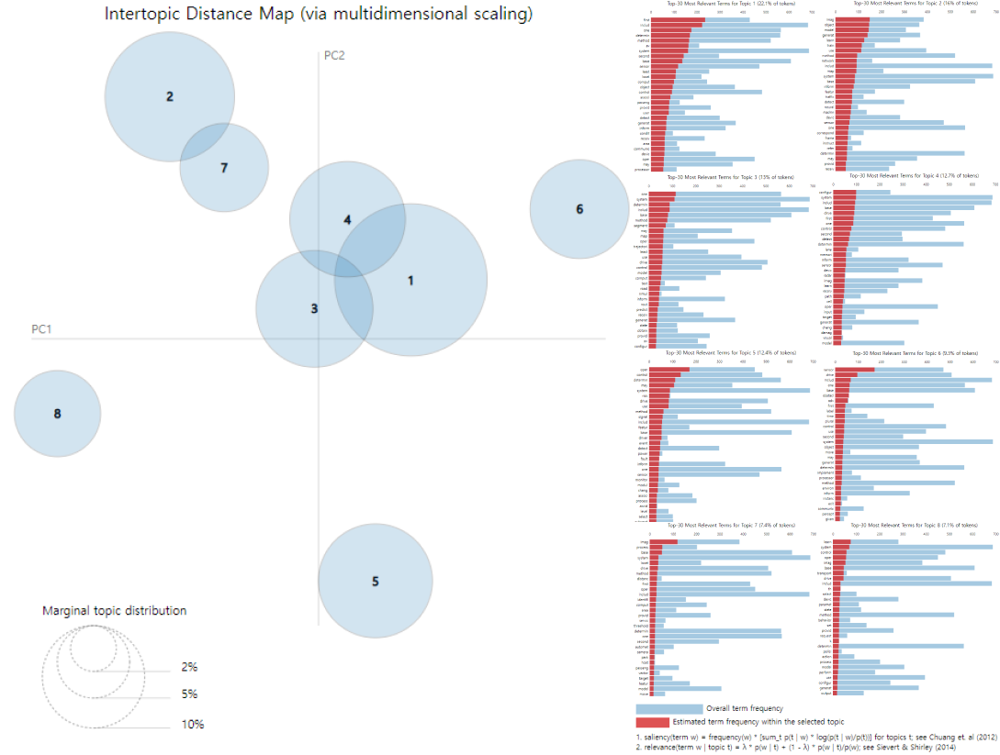

# Project
### "인공신경망 기술을 활용한 자율주행 자동차" 기술 동향 분석을 하기 위해 특허 데이터를 활용한 자연어 처리 및 기술 동향 분석

# Intro 
### 🗓️ Date 
Project term : 2022.11.03 ~ 2022.12.20  
Presentation Date : 2022.12.21  
### :man: Professor 
  한양대학교 ERICA, 산업경영공학과 김병훈 교수님 
### 👥 Team member 
  * 산업경영공학과 김윤성
  * 산업경영공학과 전재범
  * 산업경영공학과 류범영
  * 소프트웨어학과 김현기
  
# Data Set 
### ✅ Source 
- kipris에서 특허식을 작성 한 후 엑셀 파일로 export함
http://www.kipris.or.kr/khome/main.jsp?version=pc  

검색 특허식: TL=[((automatic+unmanned+autonomous)*(driving+vehicle+transport))]*(ann+"deep learning"+"artificial neural network"+cnn+"convolutional neural network"+rnn+"recurrent neural network"+dnn+"deep neural network"+"neural network")*!CCTV*!coal*!genotype*!clothes*!game*!exercise*!AGV*!plate*!aerial*!UAV*AD=[20190101~20221120]

# Contents 

### 초록
본 보고서에서는 인공지능 기술 그 중에서도 인공신경망 기술을 활용한 자율 주행 자동차의 기술 발전과 관련된 동향 분석을 제안한다. 자율주행 자동차에는 주변 인식(Perception), 측위(Localization), 경로 예측(Path Planning), 차량 제어(Vehicle Control) 이렇게 4가지 요소가 필수적이다. 자율 주행을 위해서는 주변환경에 대한 정확한 인식이 되어야 충돌을 방지하고 가감속 등의 차량 제어를 할 수 있기 때문에 Lidar, Radar, Vision, Ultrasonography 등 다양한 센서를 차량에 장착하여 주변 환경에 대한 정보와 자차 주변에 있는 객체의 정보를 얻게 된다. Lidar, Radar, Vision 센서의 데이터를 인공신경망을 통하여 융합하여 사용하는 것이 각 센서를 단일로 사용하는 것보다 좋은 성능을 나타낸다.  는 연구결과도 존재한다. KIPRIS를 활용하여 2019년 1월 1일부터 2022년 11월까지의 인공신경망 기술, 자율주행자동차 기술의 미국 특허문서 수집, 분석을 통해 인공신경망 기술을 활용한 자율주행자동차 기술의 동향을 분석하고자 한다.

1. 서론  
자율주행자동차는 운전자가 직접 조작하지 않아도 자동차가 주행환경을 인식하여 위험을 판단하고 주행경로를 계획하여 스스로 안전운행이 가능한 자동차를 말한다. 미국 자동차기술학회(SAE)는 자율주행 관련 기술을 주행 자동화를 비자동화에서 완전 자동화까지 Level 0에서 Level 5까지 6단계로 정리했다.

 Level 0은 주행 중 안전을 위해 시스템이 단순히 경고하고 일시 개입하는 전방 충돌방지 보조(FCA), 후 측방 충돌경고(BCW) 등이 이에 속한다. 신호음과 불빛을 낼 뿐, 자동차의 조종 및 속도에 관한 제어는 전적으로 운전자에게 달려있다. 
 
 현재 Level 1에 해당하는 자동화 기능은 비교적 폭넓게 보급되고 있다. 적응형 정속주행 장치, 차로 유지 보조 기능 등 단순히 경고음을 들려주는 것에서 벗어나 자동차가 제동, 조향, 가/감속 등에 직간접적으로 개입한다.
 
 테슬라를 비롯해 일부 업체들이 현재 출시하고 있는 차들은 Level 2에 해당하는 기술을 갖추고 있다. 주행 차로 자동 유지 기능, 충돌 방지 제동 보조 기능이 포함된 적응형 정속주행 장치 등을 갖추고 제한된 조건에서 차량 흐름에 따라 자율주행이 가능하며 Level 2에 해당하는 차량은 동시에 두 기능을 제어할 수 있다.
 
 대부분의 주행 상황에서 운전자가 주행에 관여하지 않아도 되는 것이 Level 3부터이다. 이 단계에서는 고속도로나 자동차 전용도로 같은 환경은 물론, 도심에서도 제한적으로 자율주행 시스템이 운전자를 대신할 수 있다. 하지만, 최종 통제권은 운전자에게 있다.
 
 SAE 가이드라인에 따르면, Level 4에 해당하는 차량은 운전자가 차량 제어에 개입하라는 요청에 적절히 응하지 못하는 상황에도 스스로 안전한 주행이 가능해야 한다. 이어서 Level 5는 인간의 개입이 전혀 필요 없는 완전한 수준의 자율주행 자동차를 의미한다.
 
 현재 자율주행자동차는 Level 3를 완성해가고 있는 단계이다. 하지만 3단계에 이르렀다고 평가하기엔 아직 이르다. 아직까지 장애물을 감지하지 못한 여러 사고들이 발생하고 있기 때문이다.
 
 현재 국내에서 양산되고 있는 차량들의 경우 Level 2에 해당하며 자동긴급제동(AEB), 전방충돌방지보조(FCA), 전방충돌경고(FCW) 등과 같은 기능들이 탑재되어있다. 자동긴급제동, 전방충돌방지보조의 경우에는 주변 차량에 대해서 인지하고 자차의 속도, 조향각 등을 고려하여 미래에 어디에 존재할지에 대한 경로 예측 기반의 기능 구현을 필요로 한다. 자율주행이 3단계를 완성하기 위한 핵심은 이러한 ADAS기능들의 성숙이라고 볼 수 있는 것이다. 
 
 
2. 연구자료 및 연구 프레임워크

A. 연구자료

본 연구에서는 인공신경망기술을 이용한 자율주행자동차의 기술 동향을 분석하기 위한 데이터를 KIPRIS 사이트를 이용하여 특허문서 형태로 수집하였다. 해외 특허 중 미국 특허로 범위를 한정하여 특허문서를 검색하였으며 자율주행 3단계 시점인 19년도를 기준으로 차후 단계를 예측하고자 출원일자를 기준으로 2019년 1월 1일부터 2022년 11월 20일까지 총 723건의 특허문서 데이터를 연구자료로 선정하였다.

자율주행자동차에 관한 특허문서를 수집하고자 automatic, unmanned, autonomous와 같은 무인, 자율에 관한 키워드를 선정하였고 driving, vehicle, transport와 같은 운행, 주행, 운전, 자동차에 관한 키워드 또한 선정하였다.

인공신경망 기술을 이용한 자율주행자동차의 기술을 분석하고자 했기 때문에 인공신경망 기술과 관련된 키워드가 필요하다고 판단하였고 artificial neural network 라는 넓은 범주의 키워드부터 CNN(Convolutional Neural Network), RNN(Recurrent Neural Network), DNN(Deep Neural Network)까지 키워드로 선정하여 검색식에 포함하였다.

위와 같은 방식으로 키워드를 선정하여 검색식을 작성한 후 특허문서를 검색한 결과 본 연구에서 필요로 하지 않는 잡음 문서들이 다량 검색이 되었다. 이를 제거하기 위해 노이즈 키워드를 찾아내어 제외시키는 방식으로 검색식을 재작성한 결과 총 723건의 특허문서를 수집하게 되었다.

B. 연구 프레임워크
 

<그림 1> 연구 프레임워크  

먼저 인공신경망 기술을 활용한 자율주행자동차의 기술을 분석하기 위해 데이터 수집을 진행하였다. 자율주행, 자동차, 인공신경망 등의 키워드를 선정하여 검색식을 작성하였고 이를 이용해 KIPRIS 사이트에서 미국 특허 723건을 수집하였다.

이후 특허 데이터를 분석하기 위해 수집한 특허 문서를 이용하여 전처리 작업을 진행하였다. 특허 문서 723건을 다운로드 후 발명의 명칭(TL), IPC분류 이 2가지에 대한 데이터를 분류하여 파일을 생성한 후 희소행렬을 제작하였다.

둘째로 간단한 특허 분석을 위해 KIPRIS에서 작성한 검색식에서 출원년도에 대한 제약을 제거한 후 검색하여 2016년부터 2022년까지 연도별로 기술동향 그래프를 제작하였다.

셋째로 해당 기술에 대해 국가별로 점유율이 어떠한지에 대해 파악하고자 출원인 국가별 특허 기술의 수에 대해 시각화하였다.

넷째로 인공신경망기술을 이용한 자율주행자동차의 전체적인 기술분야에 대해 LDA 분석을 통해 보고 이 기술들이 활성화된 기술임을 판단할 수 있게 하고자 한다.

이어서 해당 기술 분야에서 주요 출원인(기업)에 대해 분석하기 위해 X축을 특허 출원인 별 출원 평균 짜, Y축을 각 출원인 특허 별 평균 인용수, bubble size를 출원인 별 특허 출원 수로 설정한 Bubble Plot을 제작하였다.

마지막으로는 기업별 IPC 기술동향 분석 그래프를 제작하여 기업들마다 산업분야를 나누고 특허에서 사용된 IPC코드를 통해 활성화된 기술분야에 대해 시각화하여 나타내었다.

3. 실험 결과

A. 연도별 특허출원 추이 분석
   출원인의 연도별 출원 특허 추이 및 수는 다음 <그림2>와 같이 나타난다.
 

<그림 2> 연도별 특허출원 추이  

  <그림 2>의 2015년을 기준으로 2019년까지의 추이를 살펴보면 해당 기술에 대한 발전이 급격하게 이루어지는 것을 알 수 있다. 미공개 자료가 있기에 2019년 이후부터 3년간의 출원년도로 본 특허출원건수의 하락은 보는 의미가 없다고 판단할 수 있다.
  
B. 국가별 특허출원 동향 분석
 

<그림 3> 국가별 특허출원 동향   

 <그림 3>의 파이 그래프에서 확인할 수 있듯, 미국이 현재 인공신경망을 활용한 자율주행자동차 기술에 있어 414건의 특허를 출원하여 과반수 이상의 점유율을 차지하고 있다. 한국은 94건의 특허를 출원하여 2위에 위치하고 있으나, 이는 일본, 중국의 점유율과 큰 차이가 없어 해당 기술시장에서 해당 국가들에 비해 우월한 입지를 점하지 못하였다.
 
상위 10개 출원인은 다음과 같다. 중국의 Baidu가 총 50건으로 1위, 일본의 Toyota가 49건으로 2위이며, 그 뒤로 미국의 GM이 39건, 미국의 UATC와 State Farm이 34건, 한국의 Stradvision과 Hyundai이 각각 33건과 29건, 미국의 TuSimple와 Waymo, Uber가 각각 27건, 21건, 17건을 출원하였다. 중국과 일본의 경우 상위 10위에 속한 기업이 해당 국적 특허의 과반수 이상을 차지하고 있음을 확인할 수 있다.

C. 요소기술 도출
723개의 특허 데이터를 LDA 방식을 이용하여 분석하였고 단어가 특정 토픽에 존재할 확률과 각 특허 문서에 특정 토픽이 존재할 확률을 결합확률로 추정하여 토픽을 추출하였다. 하이퍼 파라미터를 변경해가며 토픽이 가장 잘 나누어졌을 때를 최종 결과로 도출하였고 그 결과 아래 <그림 4>와 같이 총 8개의 클러스터가 도출되었다.
 

 
<그림 4> 인공신경망기술을 이용한 자율주행자동차에 대한 토픽 클러스터링 결과  

상위 키워드에는 단순히 자주 등장한 단어뿐만 아니라 전체에 비해서 그 클러스터에서 높은 비율을 가진 단어들도 포함하여 해당 클러스터의 주제를 명확히 나타낼 수 있도록 하였다. 또한 대표적 관련 특허는 상위 키워드를 기존의 검색식에 추가하여 검색하였고 그 결과 비슷한 기술을 가진 특허들이 검색되었다. 결과적으로 LDA기반으로 토픽모델링을 하여 기술들을 묶는 요소 기술을 추출해 낼 수 있었다. 이를 아래 <표 1>로 나타내었다.

<표 1> LDA 클러스터링 기반 요소기술 키워드 도출  
NO	상위 키워드	대표적 관련 특허	요소 기술 특허

D. 기업별 기술동향 분석
이 분야에서 출원인들의 성향을 보기 위해 Bubble Plot을 사용하여 X축을 특허 출원인 별 출원 평균 날짜, Y축을 각 출원인 특허 별 평균 인용수, bubble size를 출원인 별 특허 출원 수로 설정하였다. X축에서 오른쪽으로 갈수록 특허 포트폴리오의 최신성을 뜻하며, Y축에서 위로 갈수록 특허 포트폴리오의 우수성을 뜻하고, bubble size가 클수록 특허를 많이 출원했다는 뜻을 내포한다.
 
 
 
<그림 5> 특허 별 평균 인용수, 평균 출원날짜에 따른 모든 특허출원인 분석결과  

<그림 5>는 모든 출원인들을 다 포함하여 Bubble Plot에 나타낸 결과이다. 이 중 자율주행 산업을 “완성차 및 부품 업체”, “자율주행 소프트웨어 개발 업체”, “자율주행 반도체(하드웨어) 생산 업체”, “자율주행 분야 투자 및 운송 관련 서비스 업체”로 4가지 분야로 나누고 이 분야를 대표하는 기업들을 선정하였다. “완성차 및 부품 업체”로 “Hyundai Motor”, “Honda Motor”, “Toyota”, “Tesla”, “GM Global”, “Ford”, “Volkswagen”을 선택하였고 “자율주행 소프트웨어 업체”는 “Aurora”, “Motional AD”, “Huawei”, “Baidu”, “Waymo”를 “자율주행 하드웨어 업체”는 “Micron”, “Samsung Electronics”를 “자율주행 분야 투자 및 운송 관련 서비스 업체”는 “State Farm Mutual Automobile Insurance Company”, “Uber”을 선택하였다.
 

 
<그림 6> 산업군에 따라 분류하여 나타낸 특허출원인 분석결과   

<그림 6>에서 보이는 바와 같이 각 색깔마다 다른 산업분야를 의미한다. “투자 및 운송 관련 서비스” 분야의 빨간색 Bubble들을 보면 아주 출원 특허 개수가 많은 것을 볼 수 있다. 운송 관련 서비스이기 때문에 아직 블루오션인 자율주행 관련 서비스가 발전 가능성이 높다고 해석할 수 있다. 특히 제일 위에 있는 “State Farm Mutual Automobile Insurance Company”는 미국의 최대 자동차 보험 회사로 특허 우수성이 상당히 높은 것을 확인할 수 있다. 다음으로 “자율주행 반도체 생산 업체”의 보라색 Bubble을 보면 다른 분야에 비해 최신성이 낮은 것을 확인할 수 있다. 이는 2020년 초반에 있었던 수요예측 실패, 자연재해, 코로나 확산 등 복합적인 영향으로 일어난 차량용 반도체 공급난 때문일거라 추측할 수 있었다. 다음으로 “완성 차량 생산 업체”의 초록색 Bubble을 보면 많은 특허 출원 수에 비해 영향력이 높지 않은 것을 볼 수 있다. 하지만 그래프에서 “자율주행 소프트웨어 개발 업체”를 뜻하는 파란색 Bubble을 보면 “완성 차량 생산 업체”보다 특허 영향력도 높고 특허의 최신성에서도 “완성차 생산 업체”보다 높은 것을 볼 수 있다. 이런 특성 때문에 자율주행 자동차 시장의 대부분의 차량 기업들은 자체 자율주행 소프트웨어를 개발하기보단 기존 자율주행 소프트웨어 개발 업체와 협력하여 차량에 탑재하는 방식이다. “현대 모비스”를 예로 들자면 위 그래프에서 “현대 모비스”는 특허 출원 수는 많고 영향력은 적지만 최신성과 영향력이 높은 자율주행 소프트웨어 개발 업체인 “Motional AD”와 협력하여 자율주행 자동차의 기술력을 높이고 있다. 
각 기업들이 어떤 세부분야에 특허를 출원하는지 알아보기 위해 IPC코드 별 기업의 특허 수를 비율로 나타낸 그래프를 제작하였다.
 

<그림 7> 기업별 IPC 기술동향 분석 그래프   

<그림 7> 그래프의 행은 각 IPC코드이며 열은 출원인명이다. 각 색깔 별로 산업분야를 나눠주었으며 파란색이 “자율주행 소프트웨어 개발 업체”, 초록색이 “완성차 및 부품 업체”, 빨간색이 “자율주행 분야 투자 및 운송 관련 서비스 업체”, 주황색이 “자율주행 반도체(하드웨어) 생산 업체”이다. 각 행의 색깔이 많이 채워져 있을수록 활성화가 된 IPC코드로 볼 수 있고 각 산업에서 업체마다 공통으로 출원이 많은 IPC코드를 활성화가 잘 된 “주요 기술”로 판단하였고 네모 박스로 시각화 하였다. 그 중에서도 모든 산업분야에서 공통으로 활성화된 IPC코드를 하이라이트 표시로 시각화 하였다. 

공통 분야를 보면 “B60W”, “G05D”, “G06K”, “G06N”, “G01S”, “G01C”로 자율주행에서 가장 기초가 되는 기술분야였다. “자율주행 소프트웨어 개발 업체”가 활성화된 기술 분야를 보면 “G08G”, “G07C”, “G06V”로 대부분 차량 주행 시스템 제어 관련 기술 분야였다. “완성차 및 부품 업체”의 활성화된 기술 분야는 “G06T”, “G06F”, “G06Q”, “G05B”으로 생성된 주행 데이터 제어 및 처리 분야였다. “자율주행 분야 투자 및 운송 관련 서비스 업체”는 “G06T”, “G08G”, “H04W”, “B60R”, “G06Q”의 기술 분야로 특정 분야의 기술에 국한되지 않고 다양한 기술 분야가 활성화된 것을 확인할 수 있었다. 마지막으로 “자율주행 반도체(하드웨어) 생산 업체”에선 “G06T”, “G06V”, “G06F”, “H04N”와 같은 전기에 의한 디지털 데이터 처리 기술 분야가 활성화되어 있었다. 이것은 자율주행분야에서 중요한 부분인 첨단운전자지원시스템(ADAS)의 각종 센서부분에 들어가는 마이크로컨트롤러(MCU), 신경망프로세서유닛(NPU), 전자제어유닛(ECU), 도메인컨트롤유닛(DCU) 등의 반도체 기술분야에 대한 특허가 활성화된 것이라고 볼 수 있다.

이 외에도 위 그래프에서 활성화가 아직 덜 된 기술 분야가 많으며 앞으로 자율주행 기술 단계를 높이기 위해서는 부족한 분야의 특허들이 많아져야 기술이 발전할 것이다.

4. 결론
본 연구에서는 인공신경망기술을 이용한 자율주행자동차의 기술 동향을 분석하였다. 해외 특허 중 미국 특허로 범위를 한정하여 특허 데이터를 수집하였으며 자율주행 3단계 시점인 19년도를 기준으로 차후 단계로의 발전에 영향을 미치고 있는 요소기술이 무엇인지 또한 해당 기술에 대해 연구하고 있는 기업은 어떤 곳인지에 대해 분석해보았다.

인공신경망 기술을 이용한 자율주행자동차의 기술은 2016년을 기준으로 급격하게 발전하고 있다는 것을 알 수 있다. 이어서 해당 기술에 대해 국가별로 점유율이 어떠한지에 대해 파악하고자 출원인 국가별 특허 기술의 수에 대해 분석하였다. 또한 인공신경망기술을 이용한 자율주행자동차의 전체적인 기술분야에 대해 LDA 분석을 통해 활성화된 기술이 어떤 분야인지를 분석하고 상위 키워드를 추출하여 대표적인 관련 특허와 요소기술을 도출해냈다.

마지막으로는 특허 출원 기업을 “완성차 및 부품 업체”, “자율주행 소프트웨어 개발 업체”, “자율주행 반도체(하드웨어) 생산 업체”, “자율주행 분야 투자 및 운송 관련 서비스 업체”로 4가지 분야로 나누고 이 분야를 대표하는 기업들을 선정하였다. 이를 통해 각 기업별로 최신성, 영향력, 활성화된 기술에 해당하는 IPC코드 총 3가지를 판단의 기준으로 정하고 어떠한 세부 기술에 대한 연구가 활발한지를 분석하였다.

본 연구는 자율주행자동차의 완전한 Level 3로의 성숙, 그리고 완전한 자율주행에 이르는 Level 5까지의 발전을 위해 필수적인 인공신경망 기술의 최근 3년간의 특허 동향을 파악하고 분석함으로써 미래 유망기술의 발전을 제안하였다.

한편, 최근 3년간의 특허 문서를 데이터로 사용한 점 때문에 특허출원일자의 추이를 분석하였을 때 시간이 지날수록 해당 기술에 대해 출원되는 특허 수가 감소한다고 보여진다. 이를 통해 특허동향을 분석할 때 이용하려는 데이터에 ‘최근 3년’이라는 제약을 두는 것은 미래 유망기술을 예측하려는 목적에서는 적합하지 않다는 한계점이 있다. 그러므로 앞으로 자율주행자동차기술의 발전을 위해 필요한 미래 유망기술을 예측하기 위해서는 최근 3년의 제약을 제거하고 특허데이터를 분석하는 추가적 연구가 필요할 것으로 보인다.

5. 참고문헌
<학위논문(국내 및 동양)>  
[1]	운봉영, "인공신경망을 이용한 자율주행 센서 데이터 융합 방법 연구", 국내석사학위논문 한양대학교 대학원, 2017. 서울  
[2]	이효진, "딥러닝 기반 주변 차량 경로예측에 관한 연구", 국내석사학위논문 국민대학교 자동차공학전문대학원, 2020. 서울  
[3]	윤도진, 김용민, “‘20년뒤 3천조 시장’ 자율주행 빅딜 계속된다”, Business Watch, 2019.09.26  
[4]	장경윤, “자율주행차용 반도체 시장, 2030년까지 3배 성장”, The Elec, 2021.08.09  
